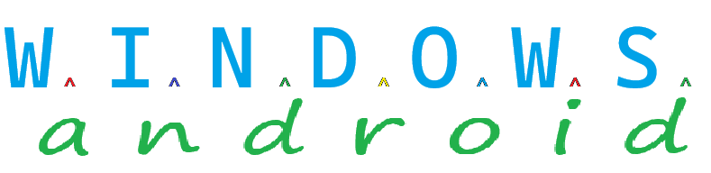

This project creates symmetry between the uses and features of Android and Windows (mobiles and desktops).

## Tested Devices
Mobiles (android):  
* 2024 Moto g Play  
* TCL XE 50 5g  
* 2025 Moto g 5g  
* 2024 Moto g Power 5g
* 2023 onn. 11 Tablet Pro

Desktops (windows):  
* Intel iMac
* Intel Mac Mini  
* HP 14 N150
* Alienware Arora R7

# Installation Instructions  
Android:  
* install termux from github releases 1.18.0
* pkg install git git-lfs
* git lfs install
* git clone the repo

Windows:
* Install git from git website
* use nano as editor
* use external ssh
* git lfs install
* git clone the repo

# Configuration Instructions:  
[Android Setup](Android/README.md)  
[Windows Setup](Windows/README.md)
